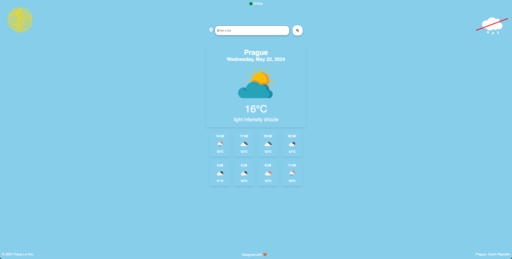
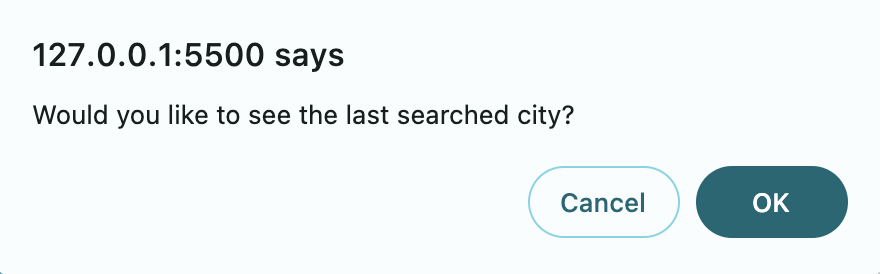
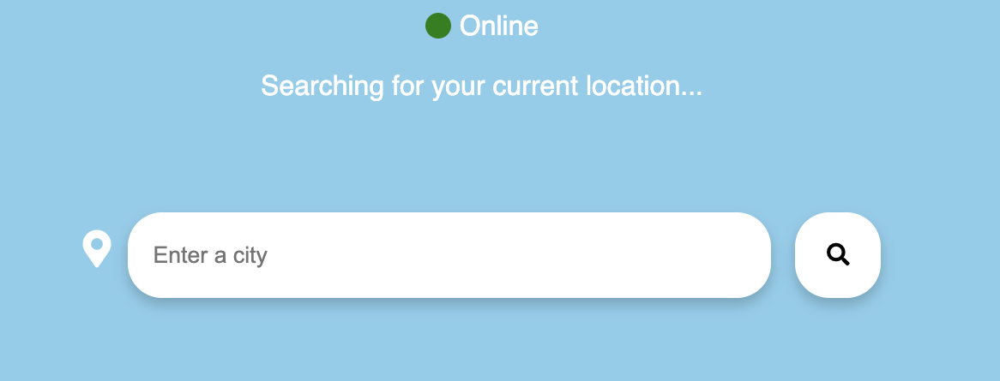
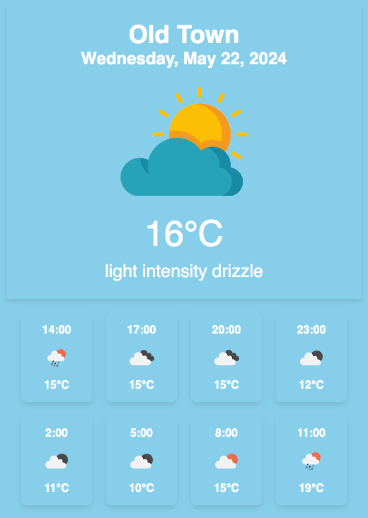
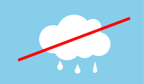
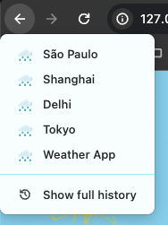

# Dokumentace

## Přehled

Jedná se o webovou aplikaci, která poskytuje uživatelům aktuální informace o počasí a hodinové předpovědi pro zadané město. Využívá API OpenWeatherMap k získání dat o počasí na základě názvu města nebo geografických souřadnic.

## Funkce

- Zobrazování aktuálních podmínek počasí, včetně teploty, popisu počasí a ikony počasí.
- Zobrazení hodinové předpovědi na následujících 24 hodin.
- Podpora pro vyhledávání informací o počasí pomocí názvu města nebo aktuální polohy uživatele.
- Spustit hudbu na pozadí.

## Použité Technologie

- HTML5
- CSS3
- JavaScript
- LocalStorage
- OpenWeatherMap API
- Geolocation API
- History API
- Media API

## Instalace

1. Naklonujte repozitář na svůj lokální stroj:

    ```bash
    git clone https://gitlab.fel.cvut.cz/leductha/kaj-weather-app.git
    ```

2. Otevřete soubor `index.html` ve webovém prohlížeči pro spuštění aplikace.

## Použití

1. Zadejte název města do vyhledávacího pole a klikněte na tlačítko vyhledávání pro zobrazení informací o počasí.
2. Kliknutím na tlačítko polohy získáte informace o počasí na základě vaší aktuální polohy.
3. V případě, že jste již předtím počasí vyhledávali, dostanete nabídku zobrazit předpověď pro poslední hledané město.
4. Kliknutím na ikonu mraku, budete moci vypnout či zapnout zvuky pršení do pozadí.
5. Při stisknutí šipky ZPĚT se můžete vrátit k naposledy vyhledávané lokaci

## Odkaz na GitHub Pages
https://thephenom00.github.io/Weather-App/

## Popis se snímky

### Vzhled aplikace


---

### Načtení posledního vyhledávaného místa
Aplikace se při každém načtení zeptá, zda-li chcete načíst poslední vyhledávané město, které se v případě potvrzení vyhledá

<div align="center">
    
</div> 

---

### Vyhledávání dle kurentní lokace uživatele
V případě kliknutí na ikonku špendlíku, se zahájí vyhledávání teploty na základě lokace uživatele

<div align="center">
    
</div> 

<div align="center">
    
</div> 

---
### Hudba
Klikne-li uživatel na ikonku mraku, spustí se hudba na pozadí, kterou může vypnout opětovným kliknutím na ikonku

<div align="center">
    
</div> 

<div align="center">
    
</div> 

---

### Historie
Každá vyhledávaná lokace je uložena a uživatel se k ní může kdykoli vrátit kliknutím na tlačítka ZPĚT

<div align="center">
    
</div> 


